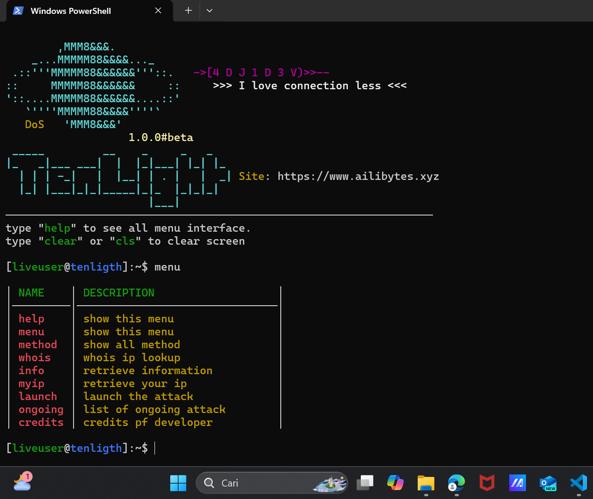

# TenLight DoS Panel

> Version : 1.0.0  
> Latest : 1.0.0



## ABOUT

TenLight DoS panel Beta Edition

> Default username => `liveuser `  
> Default password => `user`

## REQUIRED

- Nodejs 18 or later
- Python 3.8 or later

## GUIDE INSTALLATION

- For windows

  - Step 1 clone this repo
    ```cmd
    git clone https://github.com/adjidev/tenlight-dos && cd tenlight-dos/latest
    ```
  - Step 2 install the required modules
    ```cmd
    install.bat
    ```
  - Step 3 follow the installation menu then run the script

    ```cmd
    python tenlight.py
    ```

- For Linux and MacOs
  - Step 1 clone this repo
    ```bash
    git clone https://github.com/adjidev/tenlight-dos && cd tenlight-dos/latest
    ```
  - Step 2 get privileges for the install.sh files
    ```bash
    chmod += install.sh
    ```
  - Step 3 follow the installation and complete
  - Step 4 run
    ```bash
    python tenlight.py
    ```

## INFO

[My sites](https://www.ailibytes.xyz)  
[YouTube](https://www.ailibytes.xyz)  
[Telegram](https://www.ailibytes.xyz)
